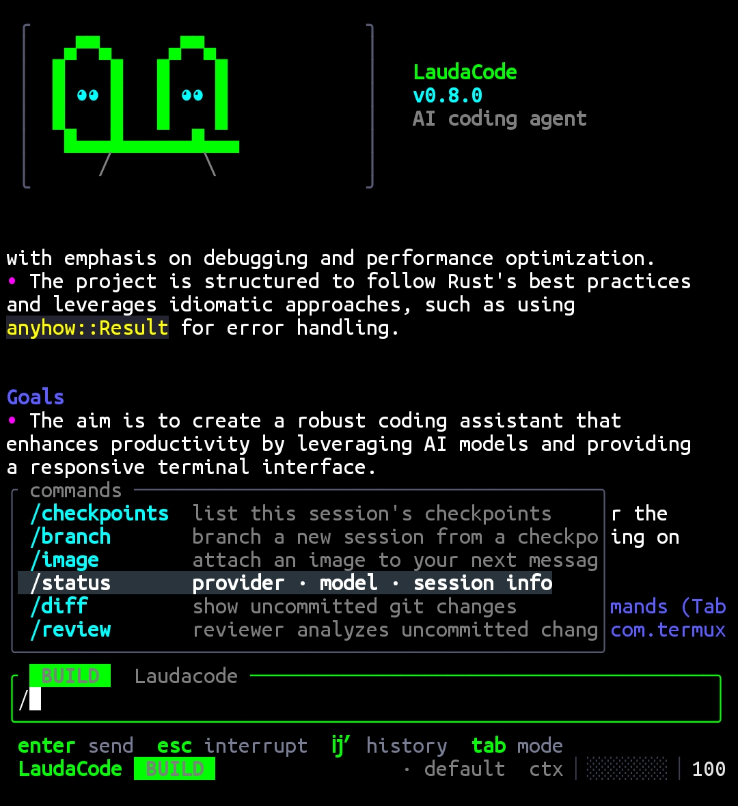

<div align="center">

# Laudacode

**A fast, lightweight AI coding agent for your terminal.**
Pure Rust, no Node.js, tiny binary, built for Termux.



[](https://rust-lang.org)
[](LICENSE)
[]()

</div>

---

Laudacode is an AI agent that lives in your terminal. It reads your project,
edits files, runs commands and fetches web docs — all under your approval —
using **any OpenAI-compatible API**: OpenAI, OpenRouter, Groq, DeepSeek,
Together, Ollama, LM Studio, llama.cpp server, vLLM…

## Features

- ⚡ **Pure Rust + Tokio + reqwest (rustls)** — one small static-ish binary, for Android/Termux
- 🔌 **Any OpenAI-compatible endpoint** — custom `base_url` / `api_key` / `model`
- 🧠 **Agentic tool loop** — `list_dir`, `read_file`, `write_file`, `edit_file`, `apply_patch`, `run_command`, `fetch_url`, `web_search`, `grep`, `glob`, `git`, `update_plan`
- 🔎 **Regex search** — `grep` is literal by default, pass `"regex": true` for a pattern; honors `ignore_case`, `context`, and has a compiled-size cap
- 📊 **Local git** — one `git` tool, fixed local allowlist, direct argv, no shell. Read: `status`, `log`, `diff`, `show`, `blame`. Write: `add`, `commit`, `branch`, `checkout`, `stash`. No `push`/`fetch`/`reset` — use `run_command` for those, so the dangerous-command detector still sees them
- 🧩 **MCP tool servers** — `[mcp_servers.<name>]` spawns any stdio MCP server and exposes its tools as `mcp__<server>__<tool>`; paged listings, per-request timeouts, name-collision rejection, and `/mcp` for status. Third-party tools ask for consent in BUILD/PLAN unless FULL AUTO
- ⚡ **Parallel tool calls** — independent reads (`read_file`, `grep`, `glob`, `fetch_url`, `web_search`, git reads) in one assistant turn run concurrently; results stay in call order, and every write still runs sequentially behind its approval
- 🪝 **Post-edit hooks** — `[hooks] post_edit` runs formatters/linters/tests after every file mutation; exit status and output go back to the model
- 💸 **Token & cost guardrails** — `[limits] max_tokens` / `max_cost_usd`; `/status` shows what's left. Cost is priced per model (input and output separately) from a built-in table, overridable with `[pricing]`; sub-agent spend counts too
- 🧾 **Structured logs** — optional JSONL trail of tool calls, usage, hook results, budget blocks; never prompts or file contents
- 🌐 **Proxy & custom CAs** — `[network] proxy` (http/https/socks5), `ca_bundle`, explicit `insecure`
- 🚦 **Patient about flaky networks** — up to 5 retries by default on dropped connections and 408/409/429/5xx, jittered exponential backoff honoring `Retry-After`. Waits show in the status line, `Esc` cancels instantly, tune with `[limits] max_retries`
- ⚙️ **Managed processes** — `start_process` / `poll_process` / `write_process` / `stop_process` for dev servers, watchers, REPLs; 16 per agent, 8 KiB per stream, process-group cleanup
- 🌐 **Web built in** — `fetch_url` plus `web_search` (DuckDuckGo)
- 🛡️ **Approval modes** — `suggest`, `auto-edit`, `full-auto`, with confirmation for dangerous commands
- 🔐 **Per-tool permissions** — `[permission.bash|edit|read|webfetch|mcp]` maps a glob to a rule, last match wins: `"*" = "ask"`, `"git *" = "allow"`, `"rm *" = "deny"`. Unmatched tools fall back to the danger heuristics. A prompt is always a *no*: Enter and EOF deny
- 🤝 **Sub-agents** — `delegate` fans a task out to specialists (`planner`, `researcher`, `coder`, `reviewer`, `tester`) running concurrently with their own contexts and reduced toolsets — `reviewer` is read-only. `/agents` lists them
- 🎓 **Skills** — markdown playbooks in `~/.config/laudacode/skills/<name>/SKILL.md` or `.laudacode/skills/<name>/SKILL.md`; `/skills` opens a searchable picker and stages the pick into the composer
- 📝 **Custom slash commands** — drop a markdown file in `.laudacode/commands/`; `$ARGUMENTS` and `$1`…`$9` expand at call time
- 🖼️ **Image input** — screenshots and photos for vision models (`-i`, `/image`)
- 📡 **Streaming responses** with reasoning-model support
- 🎨 **13 color themes** — lauda, cherry, midnight, nord, dracula, monokai, solarized, gruvbox, tokyo, everforest, ember, ice, hacker (`/theme`)
- ✨ **Ambient effects** — petals, rain, snow, matrix rain, lightning, stars, fireflies, bubbles, embers, confetti, comets, aurora (`/effect`, banner only)
- 🌈 **Syntax highlighting** — code blocks and diffs, per language (rust, python, js/ts, go, c/cpp, java, sh, toml, yaml, json)
- ⌨️ **Prompt history** — ↑/↓ recall with draft restore, persisted
- 💬 **Slash commands & input sugar** — `/provider`, `/model`, `/diff`, `/review`, `/undo`, `/compact`, `/init`, `/status`, `/export`, `/resume`, `/retry`…, plus `@file`, `#note` and `!<cmd>`
- ↩️ **Multi-turn undo** — `/undo N` reverts the last N agent turns
- 🔎 **Session cost tracking** — cumulative tokens and estimated USD in `/status`
- 📱 **Adaptive mobile UI** — banner art collapses to a one-line header on small screens
- 👆 **Touch-native** — swipe to scroll, tap picker rows, tap the composer to move the caret
- 🛠️ **Live activity feedback** — footer shows `reasoning` / `streaming` / `running <tool>` plus elapsed time
- 📄 **AGENTS.md support** — project instructions auto-loaded (`/init` generates one)
- 👤 **Profiles** — named presets in `[profiles.<name>]`, via `--profile`
- 💾 **Session persistence** — `--continue`, `--resume <id>`, `/resume`; ids, unique prefixes and names all work
- 🌿 **Checkpoints & branching** — `/checkpoint [label]`, `/checkpoints`, `/branch <n|id>`
- 🖥️ **One-shot mode** — `laudacode exec "fix the failing test"`
- 📦 **JSON output** — `--json` emits machine-readable event lines

## Install

### One-liner (Termux / Linux / macOS)

```sh
curl -fsSL https://raw.githubusercontent.com/Anon4You/Laudacode/main/install.sh | sh
```

Installs the **latest GitHub release** (auto-detected), builds it on-device and
puts `laudacode` in `$PREFIX/bin` — no sudo inside Termux. Needs `curl`, `tar`,
`rust` (Termux: `pkg install curl tar rust`). Pin an older release with
`LAUDACODE_VERSION=v0.2.0`.

### Termux / Android (manual)

```sh
pkg update && pkg install rust git -y
git clone https://github.com/Anon4You/Laudacode.git
cd Laudacode
cargo build --release
cp target/release/laudacode $PREFIX/bin/
```

> Low-RAM phone? `CARGO_PROFILE_RELEASE_LTO=off cargo build --release`

### Linux / macOS

```sh
cargo install --locked --git https://github.com/Anon4You/Laudacode
# or from a clone:
cargo install --locked --path .
```

## Quick start

```sh
export OPENAI_API_KEY="sk-or-v1-..."          # any OpenAI-compatible key
export OPENAI_BASE_URL="https://openrouter.ai/api/v1"
export OPENAI_MODEL="stealth/ox-alpha"

laudacode                                     # interactive REPL
```

Or skip env vars and configure from inside the TUI: first run has no wizard,
just type `/provider`. It opens an interactive menu (**add · use · edit · list**):
pick **add**, choose a preset (openrouter, openai, groq, deepseek, together,
cerebras, mistral, xai, fireworks, sambanova, deepinfra, nvidia, upstage,
minimax, huggingface, githubmodels, ollama, lmstudio…), paste your key, pick a
model from the live catalog. Nothing is saved until a live test request proves key and model
work — same rule for the CLI flow.

**Keyless free providers** — `powerbrain` and `aitopia` need no API key and no
model picker: picking one saves immediately with a built-in default model.
`aitopia` is the built-in default, so with nothing configured Laudacode works
out of the box, chat-first.

```sh
laudacode provider add                        # guided setup (name, url, key, model)
laudacode provider list
laudacode provider use tokenrouter
laudacode
```

One-shot tasks:

```sh
laudacode exec "explain what this repo does"
laudacode exec "add input validation to src/main.rs" --mode full-auto
```

## Configuration

Precedence: **CLI flags > profile (`--profile`) > environment variables > config file**.

| Variable         | Meaning                    |
|------------------|----------------------------|
| `OPENAI_API_KEY` | API key                    |
| `OPENAI_BASE_URL`| e.g. `https://api.groq.com/openai/v1` |
| `OPENAI_MODEL`   | model name                 |

Config file at `~/.config/laudacode/config.toml`
(or `.json`; override location with `LAUDACODE_CONFIG`):

```toml
active_provider = "openrouter"
approval_mode   = "suggest"

[providers.openrouter]
base_url = "https://openrouter.ai/api/v1"
api_key  = "sk-or-v1-..."
model    = "stealth/ox-alpha"

[providers.openrouter.headers]        # optional custom headers
"HTTP-Referer" = "https://github.com/Anon4You/Laudacode"
"X-Title"      = "Laudacode"

[profiles.fast]                       # optional presets → laudacode --profile fast
provider = "groq"
model    = "llama-3.3-70b-versatile"

[limits]                              # stop runaway loops
max_tokens   = 500000
max_cost_usd = 5.0

[pricing."anthropic/claude-sonnet-4"]  # USD per 1M tokens; beats the built-in table
input  = 3.0
output = 15.0

[hooks]                               # run after every file mutation
post_edit = ["cargo fmt", "cargo clippy --quiet -- -D warnings"]
post_edit_timeout_secs = 30

[logging]                             # JSONL trail, no prompts or file contents
enabled = true                        # no `file` → stderr
file  = "~/.local/share/laudacode/session.jsonl"

[network]                             # applies to every outgoing request
proxy     = "http://127.0.0.1:8080"  # http / https / socks5
ca_bundle = "~/.config/laudacode/corp.pem"
# insecure = true                     # skip TLS verification (risky)
```

Post-edit hooks get the touched paths in `$LAUDACODE_CHANGED_FILES`
(space-separated). Each hook's exit status and first output line go back to the
model, so a failing test run is something it can see and fix. Only
file-mutating tools trigger them.

Provider presets (OpenAI, OpenRouter, Groq, DeepSeek, Cerebras, Mistral, xAI,
Fireworks, SambaNova, DeepInfra, NVIDIA, Upstage, MiniMax, Hugging Face, Ollama,
LM Studio) and annotated versions of every block above:
[`config.example.toml`](config.example.toml).

### External tool servers (MCP)

Laudacode can host tools from any [MCP](https://modelcontextprotocol.io)
server that speaks stdio. Each configured server is spawned at startup and its
tools are exposed to the model as `mcp__<server>__<tool>`:

```toml
[mcp_servers.files]
command      = "mcp-server-filesystem"
args         = ["--root", "."]
timeout_secs = 60
```

| Key            | Default | Meaning                                          |
|----------------|---------|--------------------------------------------------|
| `command`      | —       | executable to spawn (required)                    |
| `args`         | `[]`    | arguments                                        |
| `env`          | `{}`    | extra environment variables                      |
| `cwd`          | agent's | working directory for the child                   |
| `enabled`      | `true`  | `false` keeps the config but skips startup        |
| `timeout_secs` | `60`    | per-request budget; `0` uses the default          |
| `plan`         | `false` | opt in to using these tools in PLAN mode          |

A server that fails to start is reported and skipped — the rest of the
session works normally, and `/mcp` shows what went wrong. Tool names are
sanitized for the model but the original names are what get called, and two
servers claiming the same name are rejected rather than silently shadowing
each other.

MCP tools are third-party code whose effects Laudacode cannot inspect, so
they get no danger-based auto-approval: they ask for consent in BUILD and
PLAN mode, and stay silent only in FULL AUTO. Override per tool with
permission rules:

```toml
[permission.mcp]
"mcp__files__delete" = "deny"
"mcp__*"             = "ask"
```

### Language servers (LSP)

Any stdio language server works, so the model gets real compiler-grade
feedback instead of guessing. Each server claims file extensions and is
mapped to the LSP `languageId` it expects:

```toml
[lsp_servers.rust]
command = "rust-analyzer"
filetypes = { rs = "rust" }

[lsp_servers.c]
command = "clangd"
filetypes = { c = "c", h = "c" }
```

| Key                    | Default | Meaning                                    |
|------------------------|---------|--------------------------------------------|
| `command`              | —       | executable to spawn (required)              |
| `args`                 | `[]`    | arguments                                  |
| `env`                  | `{}`    | extra environment variables                |
| `filetypes`            | `{}`    | extension (no dot) → LSP `languageId`      |
| `enabled`              | `true`  | `false` keeps the config but skips startup  |
| `root`                 | agent's | workspace root                             |
| `timeout_secs`         | `90`    | per-request budget                         |
| `init_timeout_secs`    | `120`   | `initialize` handshake budget              |
| `diagnostics_secs`     | `5`     | how long to wait for diagnostics to settle |

Check what is running with `/lsp`. Servers start at launch, so indexes are
warm before the first question; a server that fails to start is reported and
skipped without affecting anything else.

`filetypes` is an explicit mapping because `languageId` is server-specific —
`pygls` servers reject a wrong id — and two servers claiming the same
extension is rejected at load time rather than resolved by guesswork.

Diagnostics are waited on for at most `diagnostics_secs`. Analysis is often
asynchronous: `rust-analyzer` republishes a file's problems as its index
settles, so a first batch of zero diagnostics does not mean the file is fine.
If the budget runs out mid-analysis the result says it is still analysing
rather than reporting a clean file.

After any edit the server's diagnostics for the touched file are appended to
the tool result, which is a real front end instead of an LLM round trip on
`cargo check`. Only extensions a server claims are checked.

The `lsp` tool exposes the same server to the model on demand for
diagnostics, definition, references, workspace symbols, and hover, gated by
your existing read rules:

```json
{ "action": "diagnostics", "path": "src/main.rs" }
{ "action": "definition", "path": "src/main.rs", "line": 12, "column": 5 }
{ "action": "references", "path": "src/lib.rs", "line": 30, "column": 9 }
{ "action": "symbols" }
{ "action": "hover", "path": "src/main.rs", "line": 5, "column": 1 }
```

Positions are 1-based like `read_file` line numbers, and are converted to the
protocol's 0-based UTF-16 units internally, so an emoji earlier in the line
does not shift a column.

## Approval modes

Default is **BUILD** (`auto-edit`).

| `--mode` value          | TUI label  | File edits | Shell commands | Dangerous commands |
|--------------------------|------------|------------|----------------|--------------------|
| `suggest` (alias `ask`)  | PLAN       | ask        | ask            | ask                |
| `auto-edit` *(default)*  | BUILD      | ✅ auto    | ask            | ask                |
| `full-auto` (alias `yolo`)| FULL AUTO | ✅ auto    | ✅ auto        | ask (always)       |

Answer `[a]always` on any prompt to auto-approve the rest of the session. In the
TUI, switch modes any time with `/approvals` or **Tab**.

## CLI reference

```
laudacode                          # interactive session
laudacode "quick question"         # one-shot prompt
laudacode exec "<task>"            # same as above
laudacode exec "<task>" --json     # emit JSON event lines instead of prose
laudacode exec "<task>" --quiet    # suppress the banner; results only
laudacode -P groq -m llama-3.3-70b-versatile
laudacode --profile fast           # activate [profiles.fast] from your config
laudacode -i screenshot.png "what's wrong with this UI?"
laudacode --base-url http://localhost:11434/v1 --api-key ollama --model qwen2.5-coder:7b
laudacode -c                       # continue last session
laudacode -y                       # shorthand for --mode full-auto
laudacode provider add|list|use|edit|remove <name>
laudacode session checkpoints <id>            # list a session's checkpoints
laudacode session branch <id> <checkpoint>     # fork a new session from one
```

Exit codes: `0` success, `1` any failure (bad args, provider error, budget
exhausted, tool denial). Use `--json` or `--quiet` when capturing stdout — the
banner is suppressed automatically under `--json`.

## Slash commands

| Command              | Description                                  |
|----------------------|----------------------------------------------|
| `/help`              | command overview                             |
| `/model`             | pick a model from the provider's live list   |
| `/approvals`         | switch approval mode (plan/build/full-auto)  |
| `/agents`            | list the sub-agents and their roles           |
| `/reasoning`         | thinking depth: low · normal · medium · high · max |
| `/provider …`        | manage providers (`add` `list` `show` `use <name>`) |
| `/theme`             | switch color theme (live preview)            |
| `/effect`            | ambient effects (petals · rain · lightning…) |
| `/status`            | provider/model/session + token, cost, budget, hook, log & network state |
| `/mcp`               | external MCP tool servers · connected, failed, or disabled |
| `/session …`         | `rename` · `search` · `list` · `delete` sessions |
| `/checkpoint [label]`| snapshot the conversation as a branch point    |
| `/checkpoints`       | list this session's checkpoints                |
| `/branch <n\|id>`    | fork a new session from a checkpoint           |
| `/skills`            | searchable picker — pick a skill to stage it in the composer |

A skill is a directory with a `SKILL.md`. The frontmatter is optional; `name`
defaults to the directory name and `description` falls back to the first body
line. Both a one-line value and a YAML block scalar are understood:

```markdown
---
name: my-skill
description: >            # `|` keeps the line breaks, `>` folds them to spaces
  Shown in the picker and
  injected into the system prompt.
---
Full instructions. Only name + description reach the model; it reads this file
with `read_file` when the skill is relevant.
| `/diff`              | git diff of working tree                     |
| `/review`            | AI review of the current git diff            |
| `/undo [N]`          | revert file changes from the last N turns    |
| `/init`              | generate AGENTS.md for this project          |
| `/compact`           | summarize history to free context window     |
| `/clear`             | fresh conversation                           |
| `/retry`             | re-run the previous task                     |
| `/resume`            | restore a previous session by id             |
| `/image <path>`      | attach an image to your next message         |
| `/export`            | save transcript as markdown                  |
| `/quit`              | exit                                         |

Input prefixes:

| Prefix      | Effect                                        |
|-------------|-----------------------------------------------|
| `@file`     | attach a file — its contents are inlined into the prompt |
| `#note`     | save a memory into AGENTS.md                  |
| `!<command>`| run a shell command locally (no agent)        |

Keys: type `/` for autocomplete, `↑/↓` + `Tab`/`Enter` to complete,
`Ctrl+O` expands recent tool output, `Esc` interrupts the agent.

**Touch / mouse** — swipe or wheel to scroll the transcript, **tap a picker row**
to choose it (models, themes, sessions, providers…), and **tap inside the
composer** to move the caret to that position. `Ctrl+B` toggles the banner, and
the hint strip under the composer adapts to narrow windows automatically.

## License

MIT — see [LICENSE](LICENSE).

<div align="center"><sub>Built with ⚡ by Anon4You</sub></div>
